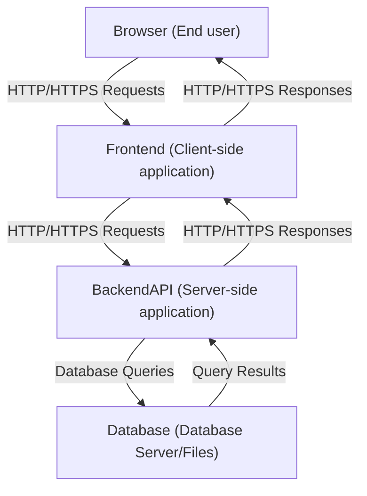

> [!faq] About this Lecture 
> Class: 41025
> Subject: #introductionToSoftwareDevelopment
> Date: 12/03/2025 
> Topics: #web-development #networking #http #client-server #full-stack

## Client-Server Architecture

### Overview

The web is built on a **client-server model** where components communicate over HTTP/HTTPS. A full-stack application has three distinct layers:



### The Three Layers

#### Client (Frontend)

- Runs **in the browser** or client application — NOT on the server
- Responsibilities:
    - Rendering the user interface
    - Capturing user input
    - Sending HTTP requests to the server
    - Displaying server responses
- Does **not** contain business logic or access the database directly

> ⚠️ **Key distinction:** Even if client code is _hosted_ on a server, it does not _execute_ there. It is delivered to the browser and runs locally.
> 
> ✅ Correct: _"Google's servers deliver the frontend resources (HTML, CSS, JS). These are then executed and rendered locally in my browser."_

#### Server (Backend)

- Handles **application logic**
- Responsibilities:
    - Defining API endpoints (routes)
    - Validating user input
    - Enforcing authentication and authorisation
    - Implementing business rules
    - Coordinating data access

#### Database

- Stores and manages **persistent data**
- Examples: `SQLite`, `PostgreSQL`, `MySQL`
- Responsibilities:
    - Storing application data
    - Enforcing data integrity and constraints
    - Executing queries from the server
- Communicates with the server via **database protocols** (not HTTP)

> ⚠️ **Important caveat:** "Client" and "server" describe _roles_, not physical machines or technology stacks.

---

## Networking Fundamentals

### IP Addresses

An **IP (Internet Protocol) address** is a unique numeric label assigned to every device on a network.

|Version|Format|Notes|
|---|---|---|
|IPv4|`xxx.xxx.xxx.xxx` (each octet: 0–255)|Most common|
|IPv6|Longer hexadecimal format|Newer; introduced to solve IPv4 exhaustion|

### Domain Names & DNS

- A **domain name** is a human-readable address identifying a website (e.g., `google.com`)
- A **Domain Name System (DNS)** converts domain names → IP addresses

### URL Structure

```
<protocol>://<domain or IP>:<port>/<path>
```

**Example:**

```
http://127.0.0.1:5000/api/users
```

|Component|Example|Description|
|---|---|---|
|Protocol|`http` / `https`|Communication protocol|
|Domain/IP|`localhost` / `127.0.0.1`|Target machine|
|Port|`3000`, `5000`, `8080`|Specific service on that machine|
|Path|`/api/users`|Resource location on the server|

**Common default ports (local development):**

- `3000` — React Dev Server
- `5000` — Flask
- `8080` — General-purpose alternative

### `localhost` — Key Facts

- `localhost` refers to **your own computer** acting as a server
- Typically resolves to IP `127.0.0.1`
- Network requests to `localhost` **never leave your machine**
- Used for **development and testing**

> ⚠️ **Gotcha:** `localhost` ≠ `127.0.0.1` in Flask CORS — they are treated as **different origins**!

### Same-Origin vs Cross-Origin

**Same-origin** requires all three to match:

|Condition|Example|
|---|---|
|Same protocol|Both `http` or both `https`|
|Same domain/host|Both `localhost` or both `127.0.0.1`|
|Same port|Both `:5000`|

Any mismatch → **cross-origin request** (subject to CORS restrictions — covered in Week 9)

---

## Static vs Dynamic Content

|Type|Description|Example|
|---|---|---|
|**Static**|Doesn't change per user or request|HTML served as-is from frontend|
|**Dynamic**|Changes based on user, data, or context|HTML generated by backend; API responses|

---

## APIs

### Definition

**API (Application Programming Interface)** — in web development, refers to the interface between client and server.

- Typically **RESTful APIs** (Representational State Transfer) using HTTP methods
- Provides a **contract** between client and server specifying:
    - What data can be requested or modified
    - How requests should be structured
    - What responses will be returned
- **Decouples frontend from backend** → improves maintainability and scalability

---

## HTTP Requests & Responses

### HTTP Methods

Each method maps to a CRUD operation:

|Method|Operation|Common Use|
|---|---|---|
|`GET`|Read|Retrieve data from server|
|`POST`|Create|Create a new resource|
|`PUT`|Replace|Replace an existing resource entirely|
|`PATCH`|Update|Partially update an existing resource|
|`DELETE`|Delete|Remove data from the database|

> ℹ️ HTTP methods are part of the HTTP specification and define _intended_ semantics — not always strictly enforced by all servers/clients.

### HTTP Headers

Headers let the client and server pass **additional metadata** with requests and responses.

#### Common Request Headers

|Header|Example Value|Description|
|---|---|---|
|`Host`|`http://127.0.0.1:8080`|Target server hostname and port|
|`Content-Type`|`application/json`|Format of the request payload|
|`Authorization`|`Bearer <token>`|Bearer token for client authentication [^1]|

#### Common Response Headers

|Header|Example Value|Description|
|---|---|---|
|`Content-Type`|`text/html` / `application/json`|Format of the response body|
|`Content-Length`|`512`|Size of the response body in bytes|
|`Server`|`SimpleHTTP/0.6 Python/3.12.1`|Web server software info|
|`Date`|`Thu, 22 Jan 2026 01:15:30 GMT`|Timestamp the response was generated|

> 📝 In Flask, essential response headers are **automatically set**.

🔗 Reference: [MDN HTTP Headers](https://developer.mozilla.org/en-US/docs/Web/HTTP/Reference/Headers)

### HTTP Response Status Codes

Status codes indicate whether a request succeeded or failed.

|Code|Name|Meaning|Example Message|
|---|---|---|---|
|`200`|OK|Request succeeded|`"Allocation retrieved successfully."`|
|`201`|Created|New resource was created|`"New allocation created."`|
|`400`|Bad Request|Client-side error in the request|`"Missing 'project' field."`|
|`404`|Not Found|URL/resource not recognised|`"No allocation found for 'Community Website Redesign'."`|
|`409`|Conflict|Request conflicts with server state|`"Project 'Community Website Redesign' already exists."`|
|`500`|Internal Server Error|Unexpected server-side failure|`"Unexpected Database Error."`|

🔗 Reference: [MDN HTTP Status Codes](https://developer.mozilla.org/en-US/docs/Web/HTTP/Reference/Status)

### HTTP Request/Response Examples

**Making a POST request using cURL:**

```bash
curl -X POST http://127.0.0.1:8080/welcome \
     -H "Content-Type: application/json" \
     -d '{"name":"TU1"}'
```

**A Flask HTTP response (Python tuple):**

```json
({"status": "success", "message": "Hello, TU1!"}, 200)
```

> The tuple format is `(response_body, status_code)` — standard Flask convention.

---

## Client-Server Communication Flow

### Step-by-Step: Frontend ↔ Backend

1. User performs an action (e.g., submits a form, clicks a button)
2. Client sends an **HTTP request** to the server containing:
    - Request method (e.g., `GET`, `POST`)
    - Target URL
    - Any required data (body/headers)
3. Server **receives and processes** the request
4. Server generates an **HTTP response** containing:
    - Data (body)
    - Status code (success/failure indicator)
    - Headers
5. Client receives the response and **updates the UI**

### Step-by-Step: Backend ↔ Database

1. Server receives a client request requiring data
2. Server sends a **database query** (e.g., SQL statement)
3. Database **executes** the query
4. Database returns **result set** or operation confirmation
5. Server **processes** the data and incorporates it into the HTTP response

> ⚠️ Server ↔ Database communication uses **database protocols**, not HTTP.

---

## Web Servers

> ⚠️ **Do not confuse** "web server software" with the "server" in the client-server architecture.

**Web server software** = programs that _listen_ for HTTP requests and serve content.

|Web Server|Description|
|---|---|
|**Apache HTTP Server**|Popular open-source; serves static files, can proxy to app servers|
|**Nginx**|High-performance; often serves static files or forwards to app servers|
|**Python `http.server`**|Built-in Python module; simple local testing only; serves static files|
|**Node.js + Express**|Runtime + framework acting as a web server for dynamic content|
|**Gunicorn / uWSGI**|Python app servers; often paired with Nginx for dynamic content|

---

## Footnotes & Key Definitions

[^1]: **Bearer Token** — In HTTP authentication, `Bearer` refers to a token type in the `Authorization` header. The client that _bears_ (possesses) the token is trusted by the server.

---

## Connections to Other Topics

- **CORS (Cross-Origin Resource Sharing)** — Week 9; important when `localhost` vs `127.0.0.1` causes origin mismatch in Flask
- **Authentication** — `Authorization: Bearer <token>` header is central to JWT-based auth
- **REST APIs** — builds on HTTP methods and status codes covered here
- **SQL/Databases** — server-database communication via queries (CRUD operations)

---

## Quick-Reference Summary

|Concept|Key Point|
|---|---|
|Client|Runs in browser; no direct DB access|
|Server|Handles logic; sits between client and DB|
|Database|Persistent storage; communicates via DB protocol|
|`localhost`|Your own machine; never leaves your network|
|`localhost` vs `127.0.0.1`|Different origins in Flask CORS|
|HTTP Methods|GET/POST/PUT/PATCH/DELETE → CRUD|
|Status 2xx|Success|
|Status 4xx|Client error|
|Status 5xx|Server error|
|Static content|Unchanged per user/request|
|Dynamic content|Changes based on user/data/context|