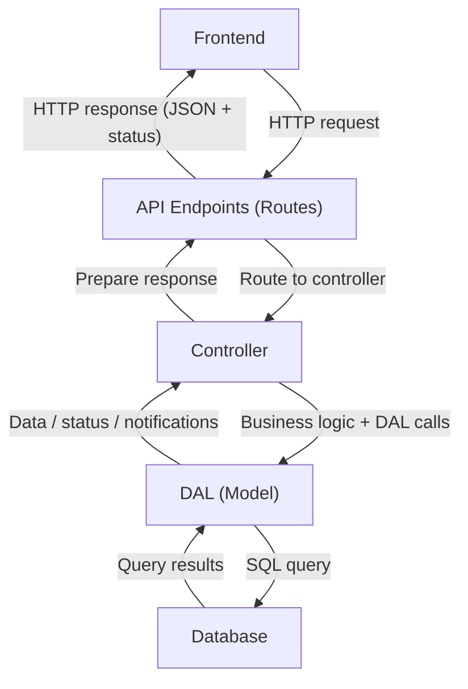

> [!faq] About this Lecture 
> Class: 41025
> Subject: #introductionToSoftwareDevelopment
> Date: 07/04/2025 
> Topics: 

## Model refactoring — entity modelling

- A `User` class is introduced to replace raw `sqlite3.Row` objects as the return type from DAL read operations
- Affected functions: `get_user_by_email`, `get_user_by_id`, `get_all_users`
- Modelling entities as classes provides:
  - Data integrity and validation at the application layer
  - Consistent data structure across the codebase
  - Clear mapping between Python objects and database tables
  - Improved maintainability and collaboration

> **Note:** The sample code does not incorporate `User` in all DAL operations — only where necessary for now

---

## Separating controllers from routes

### The problem

Previously, `auth.py` and `users.py` combined routing logic *and* business logic in the same file. This made testing harder and violated separation of concerns.

### The refactor

| Before | After |
|--------|-------|
| `auth.py` | `auth.py` (routes only) + `auth_controller.py` |
| `users.py` | `users.py` (routes only) + `user_controller.py` |

### Route responsibilities (after refactor)

- Expose API endpoints
- Extract data from the HTTP request
- Format and return responses using `jsonify(response), status`
- Routes always return JSON + a status code — directly consumable by JavaScript `fetch()` on the frontend

### Controller responsibilities

- Contain all business logic
- Interact with the DAL
- Return values in a **consistent format**:
```python
{"status": "<success/failure>", "message": "xxx"}, status_code
```

---

## Server-side validation in `auth_controller.py`

### Email validation
```python
import re

def is_email_valid(email):
    return bool(re.match(r'^[a-zA-Z0-9._%+-]+@[a-zA-Z0-9.-]+\.[a-zA-Z]{2,}$', email))
```

**Regex breakdown** — the pattern enforces the structure $\text{x@y.z}$:

| Part | Pattern | Allowed characters |
|------|---------|-------------------|
| Local part $x$ | `[a-zA-Z0-9._%+-]+` | Letters, digits, `._%+-` |
| Domain $y$ | `[a-zA-Z0-9.-]+` | Letters, digits, `.-` |
| TLD $z$ | `[a-zA-Z]{2,}` | 2+ letters only |

- `^` and `$` anchor the match to the full string (no partial matches)
- `re` is Python's built-in regular expression module

### Interpreting DAL responses meaningfully

- `sqlite3` queries can return `None` from `fetchone()` if no record is found — this does **not** raise an exception
- The controller must interpret this and return a meaningful message, e.g.:
```python
if user is None:
    return {"status": "failure", "message": "Queried user does not exist."}, 404
```

---

## Request flow — full MVC picture


**Key principle:** Each layer only communicates with its immediate neighbours — the frontend never touches the DAL directly.

---

## Security — DOS prevention

Added to `create_app()` in `app.py` to limit fields in POST requests and prevent abuse:
```python
MAX_FIELDS = 5

@app.before_request
def limit_request_fields():
    if request.method == "POST":
        data = request.json
        if data and len(data) > MAX_FIELDS:
            return jsonify({
                "status": "error",
                "message": f"Too many fields in request. Maximum allowed is {MAX_FIELDS}."
            }), 400
```

- `@app.before_request` runs this function **before every request** is processed
- Returns HTTP `400 Bad Request` if the payload exceeds `MAX_FIELDS` fields
- Protects against denial-of-service (DOS) attacks that flood the server with large payloads

---

## Unit testing controllers

### Why separation enables testing

- Controllers can now be tested **without starting the Flask server** and without making HTTP requests
- This is called **unit testing** — testing one component in isolation

### Example — `test_admin_add_and_get_user()`
```python
# Direct controller call — no HTTP involved
add_new_user(...)       # from user_controller.py
view_user(...)          # from user_controller.py — assert user was added
```

---

## API endpoint testing with `unittest` + `requests`

File: `backend/tests/test_auth_api.py`

### Setup
```python
import unittest
import requests

BASE_AUTH_URL = "http://127.0.0.1:8080/auth"
HEADERS = {"Content-Type": "application/json"}

TEST_USER = {
    "email": "authuser@example.com",
    "password": "XXXXXXXX",
    "name": "Auth User"
}
```

### Sending a request
```python
response = requests.post(f"{BASE_AUTH_URL}/register", json=TEST_USER, headers=HEADERS)
```

- `requests.post` sends an HTTP POST to the given URL
- `json=TEST_USER` serialises the dict as JSON in the request body
- `headers={"Content-Type": "application/json"}` tells the server to expect JSON

### Analysing the response
```python
response.status_code    # integer HTTP status, e.g. 200, 201, 400
response.text           # raw response body as a string
response.json()         # parses response body as JSON into a dict
```

### Writing an assertion
```python
def test_1_register_user(self):
    """Test POST /auth/register"""
    response = requests.post(f"{BASE_AUTH_URL}/register", json=TEST_USER, headers=HEADERS)
    self.assertIn(response.status_code, [200, 201], "User registration failed")
```

- `assertIn(value, container, msg)` — passes if `value` is in `container`, fails with `msg` otherwise
- Accepts both `200 OK` and `201 Created` as valid success codes

---

## Alternative testing tools (not required in ISD)

### Postman
- Organises tests into **collections** of requests
- Request body sent as **raw JSON** in the body tab (not as URL parameters)

### cURL
- Command-line tool available on all major operating systems
- Simpler setup, good for quick testing during development
```bash
curl -X POST http://127.0.0.1:8080/welcome \
     -H "Content-Type: application/json" \
     -d '{"name":"alice"}'
```

- `-X POST` — specifies the HTTP method
- `-H` — sets a request header
- `-d` — sets the request body payload

---

## Summary — key concepts

| Concept | Purpose |
|---------|---------|
| `User` class (Model) | Consistent return type from DAL reads |
| Controller layer | Business logic, DAL calls, meaningful error messages |
| Route layer | HTTP interface only — no logic |
| `re.match` for validation | Server-side email/password format checking |
| `@app.before_request` | Middleware hook for security checks |
| `unittest` + `requests` | API endpoint testing without Postman/cURL |
| Separated controllers | Enables unit testing without a running server |

## Connections to other topics

- **Week 9:** JavaScript `fetch()` on the frontend consuming the JSON responses returned by routes
- **DAL (`db_crud.py`):** The layer that controllers call to read/write the database
- **MVC pattern:** Model (DAL + `User` class) → Controller → View (Routes/API endpoints)